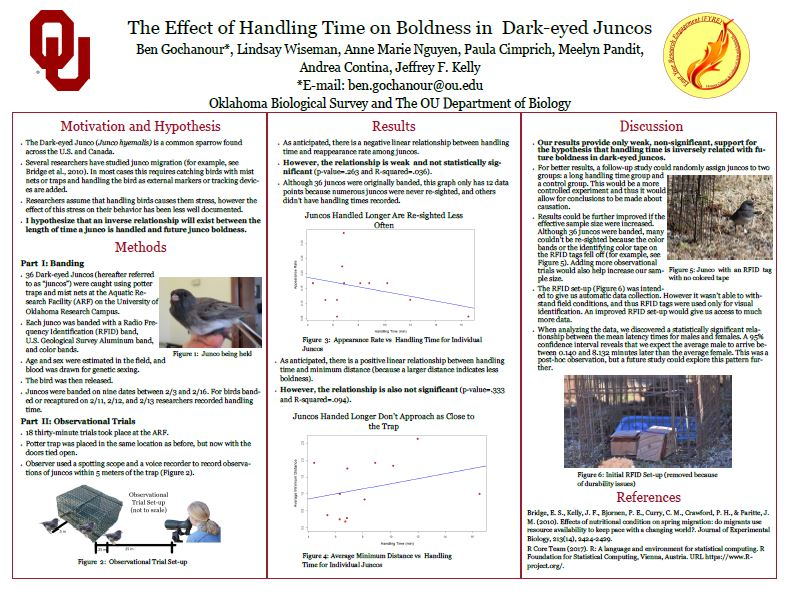

Presenting author(s) are indicated with an asterisk (*).

# **2020**

**B. Gochanour**\*, S. Chen., L. Beebe. and D. Haziza. 2020. A Nonparametric Multiply Robust Multiple Imputation Method for Causal Inference. Joint Statistical Meetings (Contributed Poster Session). Virtual Conference.

<iframe width="400" height="220" src="https://www.youtube.com/embed/q12whzSv4pg" frameborder="0" allow="accelerometer; encrypted-media; gyroscope; picture-in-picture" allowfullscreen></iframe>

A. Contina\*, **B. Gochanour**, J.L. Alcantara, and M.B. Wunder. 2020. Stable Isotopes in Conservation Biology: Case Studies in Migratory Birds. The North American Congress for Conservation Biology (NACCB), Denver, Colorado.

**B. Gochanour**\*, S. Chen., L. Beebe. and D. Haziza. 2020. A Nonparametric Multiply Robust Multiple Imputation Method for Causal Inference. Scheduled for poster presentation at the 2020 Graduate Research Education and Technology (GREAT) symposium, canceled due to COVID-19 pandemic.

# **2019**

**B. Gochanour**\*. 2019. Investigating Math Motivation and Math Anxiety in Undergraduate Students. University of Oklahoma, Research in Undergraduate Math Education Seminar. Norman, Oklahoma.
 
<a href="hon_presentation.pdf#" class="download">Download Slides</a> or
<a href="hon_thesis.pdf#" class="download">Download Full Honors Thesis</a>	

{width=45% height=45%}

 

# **2018**

**B. Gochanour**\*, L. Wiseman, A.M. Nguyen, P. Cimprich, M. Pandit, A. Contina, J.F. Kelly. 2018. The Effect of Handling Time on Boldness in Dark-eyed Juncos. First Year Research Experience Presentation Session. Norman, Oklahoma.
 
<a href="fyre.pdf#" class="download"> Download Poster PDF</a>

{width=45% height=45%}

 

