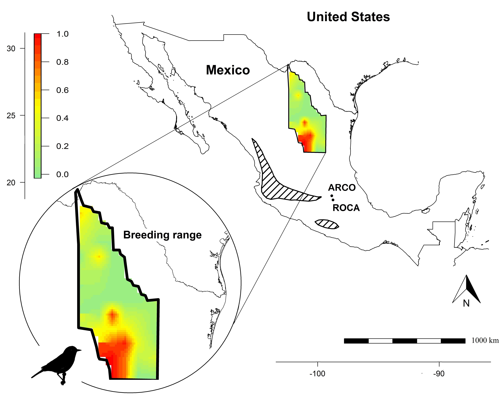

## **Accepted**

**B. Gochanour**, J. Alcantara, P. Cimprich, J. F. Kelly, and A. Contina. 2021+. Filling the Gap: Molting Behavior of Colima Warblers and Research Opportunities for Understudied North American Songbirds. Accepted by *The Southwestern Naturalist*.

Abstract: We implemented stable isotope analysis to evaluate the molt of the Colima Warbler (Leiothlypis crissalis), an understudied migratory songbird occurring in Mexico and recently discovered breeding in the southern part of Texas, USA. We built a geostatistical model showing variation in deuterium precipitation values ($\delta^{2}H_p$) across a latitudinal gradient within the Colima Warbler breeding range in northeastern Mexico . Then, based on stable isotope ratios of deuterium in feathers ($\delta^{2}H_f$), we assigned wintering Colima Warblers captured in Central Mexico to possible molting areas near the southwestern portion of the recognized species breeding range. To the best of our knowledge, we provide the first records of the species occurring within the Parque Ecológico de la Ciudad de México, near the mountain ranges surrounding the Basin of Mexico. Overall, our study demonstrates the potential  of winter ecology field work in conjunction with molecular study techniques, such as stable isotope analysis,  for revealing the migratory and molting behavior of warblers with restricted distribution ranges. 

{width=70% height=70%}

 

## **Submitted**

**B. Gochanour**, S. Chen, L. Beebe, and D. Haziza. 2021+. A Nonparametric Multiply Robust Multiple Imputation Method for Causal Inference. Submitted to *Canadian Journal of Statistics*.

Abstract: Evaluating the impact of non-randomized treatment on various health outcomes is
difficult in observational studies because of the presence of covariates that may affect
both the treatment or exposure received and the outcome of interest. In the present
study, we develop a nonparametric multiply robust multiple imputation method for
estimating average treatment effects in such studies, approaching the challenge from
the perspective of potential outcomes. Our method relies on multiple propensity score
models and outcome regression models, and is multiply robust in that it performs
well if at least one of the models is correctly specified. We develop the asymptotic
properties of our method and test it in a simulation study, evaluating its performance
with regard to efficiency, bias, and coverage probability. Rubin’s variance estimation
formula can be used safely for estimating the variance of our proposed estimators.
Finally, we apply our method to NHANES data to examine the effect of exposure to
perfluoroalkyl acids (PFAs) on kidney function.

## **In Preparation**

**B. Gochanour**, S. Chen, L. Beebe. and D. Haziza. 2021+. Bayesian Multiply Robust Estimation for Causal Inference.

**B. Gochanour**, J. Fernández-López J, and A. Contina. 2021+. abmR: An R Package for Agent-based Model Analysis of Large-scale Movements Across Taxa.

N. Ferdows, A. Kumar, S. Chen, M. Rivera-Hernandez, A. Karmarkar, and **B. Gochanour**. 2021+. Post-acute Care Utilization Pattern During the COVID-19 Pandemic.

N. Ferdows, A. Kumar, S. Chen, M. Rivera-Hernandez, and **B. Gochanour**. 2021+. Assessment of Racial Disparities in COVID-19-related Mortality Among Individuals Living in US Rural vs Urban Counties

