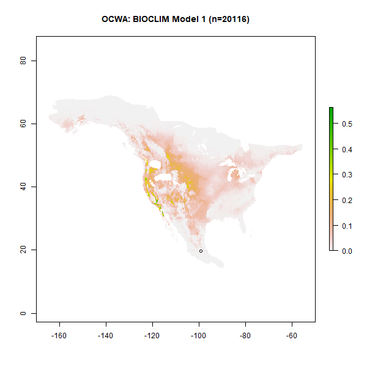

# **2020**

*Modeling Migration in Warblers*

Benjamin Gochanour, Andrea Contina

{width=35% height=35%}

 

*A Multiply Robust Multiple Imputation Method for Causal Inference*

Benjamin Gochanour, Sixia Chen, David Haziza

Abstract: Evaluating the impact of non-randomized treatment on health outcomes is difficult in observational studies because of confounding variables that may affect both the behavior and the outcome of interest and there is no direct causal effect of the treatment due to non-randomness. In the present study, we develop a non-parametric multiply robust multiple imputation method for estimating mean treatment effects in such observational studies, treating the challenge as a missing data problem. Our method relies on multiple propensity score models and outcome regression models and is multiply robust in that it performs well as long as at least one of the models is correctly specified. We develop the asymptotic properties of our method and test it in a simulation study, evaluating its performance in terms of bias, efficiency, and coverage probability. Finally, we apply our method to real data and evaluate the results compared to traditional methods.
